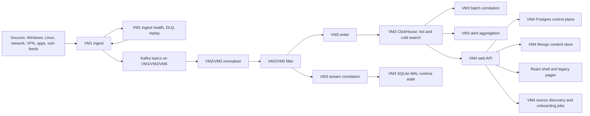

# Rdegon SIEM Architecture

## Platform Topology

| VM | Address | Role |
| --- | --- | --- |
| `VM1` | `192.168.1.35` | Ingest edge: syslog, HTTP collectors, ingress health |
| `VM2` | `192.168.1.37` | Kafka and processing: normalizer, filter |
| `VM3` | `192.168.1.38` | Storage and detection: ClickHouse, writer, stream correlation, batch correlation, alert aggregation, SQLite runtime state |
| `VM4` | `192.168.1.39` | Web/API/React UI, docs, reports, Postgres control plane, Mongo content plane |
| `VM5` | `192.168.1.40` | Kafka and standby processing/storage services |

## Core Data Flow

## Runtime Services

| Layer | Main services |
| --- | --- |
| Ingest | `nginx`, `siem-ingest` |
| Processing | `siem-kafka`, `siem-normalizer`, `siem-normalizer@2`, `siem-filter`, `siem-filter@2` |
| Storage and detection | `clickhouse-server`, `siem-writer`, `siem-writer@2`, `siem-stream-corr`, `siem-batch-corr`, `siem-alert-agg` |
| Web and UX | `nginx`, `siem-web`, `frontend-react/dist`, `mongod`, `postgresql` |

## Enterprise Foundation Slice

The `2026-03-12` enterprise foundation slice extends the existing runtime with a first-class control plane hosted by the web service on `VM4`.

### New control-plane domains

- `connector_definition`
- `connector_run`
- `service_account`
- `api_token`
- `case`
- `entity`
- `risk_signal`
- `response_action`
- `response_execution`
- `content_bundle`
- `saved_search`
- `audit_event`
- secret-readiness inventory
- aggregated health overview

### Current control-plane storage

- Implementation module: `enterprise_control_plane.py`
- Current storage modes:
  - `filesystem` as JSON collections in `services/web/app/runtime-control-plane/`
  - `postgres` document table through `SIEM_CONTROL_PLANE_BACKEND=postgres`
- Current deployment locality: `VM4`
- Current purpose: operational control-plane slice with database-backed persistence and a filesystem snapshot fallback for export and recovery
- Current live mode on VM4: `postgres` after the `2026-03-20` cutover, verified through `/api/control-plane/storage`

### Postgres control-plane migration slice

The `2026-03-21` follow-up adds a real migration path from filesystem snapshots into Postgres:

- filesystem snapshot readout through the same control-plane domain model
- explicit corruption reporting instead of silent JSON reset
- collection-count reporting through `/api/control-plane/storage`
- migration state, imported collections, skipped collections, and last migration timestamp
- health surfacing through `/api/health/overview`

The filesystem snapshot remains useful only as:

- pre-cutover backup
- export artifact
- rollback source

It is no longer the intended authoritative live store after Postgres enablement.

### Historical note: upgrades that were not part of the original slice

- transport-wide replay and backpressure across the full bus, not only at the ingest edge
- OIDC, SAML, LDAP, and AD
- vault-backed secret references by default
- storage HA for Postgres, MongoDB, and ClickHouse

As of `March 27, 2026`, the current stand has already landed:

- `OIDC-first` identity through `Keycloak on VM4`
- Vault-backed runtime secret resolution on `VM4`
- storage HA for ClickHouse, Postgres, and Mongo, with `/api/health/storage-ha` as the truth surface

`SAML`, `LDAP`, and `AD` remain future federation follow-up, not live login methods on the current stand.

## Access Plane Slice

The `2026-03-13` access-plane follow-up extends the `VM4` control plane with machine identities.

### New access-plane capabilities

- service accounts with explicit scoped permissions
- one-time API token issuance with hashed-at-rest storage
- token revocation
- token last-used tracking
- API authentication through `Authorization: Bearer <token>` or `X-API-Token`
- access-plane metrics summarized inside `/api/health/overview`

### Current access limitations

- service accounts are local to the current `VM4` control plane
- service-account tokens remain machine auth, not human SSO
- human auth is now `OIDC-first` through Keycloak on `VM4`
- `SAML`, `LDAP`, and Active Directory remain future federation follow-up rather than live login methods

## Ingest Fabric Slice

The `2026-03-13` ingest slice extends the existing edge on `VM1` without changing the rest of the pipeline contract.

### New ingest-edge capabilities

- live source heartbeat surfaced through ingest runtime APIs
- live collector heartbeat surfaced through ingest runtime APIs
- ingest metrics surfaced through ingest runtime APIs
- dead-letter queue exposed through the ingest runtime and Kafka-era transport health
- replay state recorded through the ingest runtime admin path
- runtime admin APIs on `VM1`
- proxy APIs on `VM4`
- native React route at `/app/ingest`

### Ingest-edge API split

- `VM1` now exposes `/health/overview`, `/health/sources`, `/health/collectors`, `/dlq/events`, and `/dlq/replay`
- `VM4` proxies them as `/api/ingest/overview`, `/api/ingest/sources`, `/api/ingest/collectors`, `/api/ingest/dlq`, and `/api/ingest/dlq/replay`

### Current ingest limitations after the slice

- replay remains strongest at the edge on `VM1`
- broker-level lag and transport health now come from Kafka, not Redis
- end-to-end replay beyond the current ingest/runtime path still needs further maturation

## Stream Correlation Slice

The `2026-03-21` stream-correlation follow-up upgrades `VM3` from processing-time threshold evaluation to event-time-aware evaluation.

### Runtime capabilities

- `SIEM_STREAM_CORR_TIME_MODE=event|processing`
- `SIEM_STREAM_CORR_ALLOWED_LATENESS_SEC`
- `SIEM_STREAM_CORR_WATERMARK_LAG_SEC`
- `SIEM_STREAM_CORR_SHADOW_COMPARE=true|false`
- timestamp fallback tracking when event timestamps are missing or invalid
- late-event accounting
- runtime status snapshots written to `siem.stream_corr_runtime_status`
- VM4 health visibility through `platform.stream_correlation`

### Shadow-compare model

- primary mode can run as `event` or `processing`
- the alternate mode can run in shadow for comparison
- mismatches are counted and surfaced through `/api/health/overview`
- current live rollout uses `event` as the primary mode and `processing` as the shadow path before retiring the rollback toggle

### Runtime state backend

The `2026-03-22` follow-up also removes Redis from the live stream-correlation state path:

- runtime state now lives in SQLite WAL at `/var/lib/siem-stream-corr/runtime-state.db`
- runtime status is written to `siem.stream_corr_runtime_status`
- `/api/health/overview` and `/api/health/transport` now surface `state_backend=sqlite`
- Kafka is now the active transport bus, and SQLite holds the live correlation window state

## Content Plane Slice

The `2026-03-22` content-store follow-up enables the first non-filesystem production content backend.

### Live content-store backend

- implementation module: `content_store.py`
- live backend on `VM4`: `mongo`
- current content-backed collections:
  - `content_bundle`
  - `saved_search`
  - `docs_pages`
  - `dashboard_instances`
  - `builder_drafts`
- filesystem remains only as:
  - bootstrap seed
  - export artifact
  - rollback source

### Infra note

MongoDB 7 required `AVX`, which the previous Proxmox guest CPU profile on `VM4` did not expose.

The live fix was:

- Proxmox VM `107` CPU profile changed from `x86-64-v2-AES` to `x86-64-v3`
- `mongod` enabled on `VM4`
- content collections migrated from filesystem snapshots into MongoDB

This is now part of the repeatable cutover path and should not be treated as an undocumented one-off repair.

## Search And Storage

### ClickHouse

Primary tables and views currently used by the SIEM:

- `siem.events`
- `siem.events_cold`
- `siem.alerts_raw`
- `siem.alerts_agg`
- `siem.alert_history`
- `siem.detection_rule_catalog`
- `siem.normalizer_rules`
- `siem.filter_rules`
- `siem.cmdb_assets`
- `siem.threat_intel_iocs`
- `siem.active_list_items`

### Kafka

Current active topics:

- `siem.raw`
- `siem.normalized`
- `siem.filtered`
- `siem.dlq`
- `siem.replay`
- `siem.transport.audit`

Current live consumer groups:

- `siem-normalizer`
- `siem-filter`
- `siem-writer`
- `siem-stream-corr`

### Current transport state

- Kafka is the live transport backend across `VM1`, `VM2`, and `VM5`
- `VM2` and `VM5` share active processing responsibilities for `normalizer` and `filter`
- `VM3` consumes Kafka for writer and detection paths
- Redis is retired from the live data path and remains only in archival incident documentation
- watchdog and CD health now validate Kafka/runtime flow, not Redis liveness
- live correlation state remains on SQLite WAL on `VM3`

### Current storage HA state

- ClickHouse live primary remains on `VM3` with standby sync on `VM5`
- Postgres live primary remains on `VM4` with standby on `VM1`
- Mongo content plane runs as a replica set across `VM4`, `VM1`, and `VM5`
- `/api/health/storage-ha` is the current truth surface for replica/standby readiness

## Web Slice Layout

The local baseline is stored in:

- `C:\Users\Rdegon\Projects\siem_xfer_2026-03-25\repo`

The live VM4 web slice is stored in:

- `/opt/siem/siem-solution/services/web`

Important mapping:

- local `main.py` -> remote `services/web/main.py`
- local `security.py` -> remote `services/web/app/security.py`
- local `deps.py` -> remote `services/web/app/deps.py`
- local `console.py` -> remote `services/web/app/routes/console.py`
- local `alerts.py` -> remote `services/web/app/routes/alerts.py`
- local `enterprise_control_plane.py` -> remote `services/web/app/enterprise_control_plane.py`
- local `source_discovery.py` -> remote `services/web/app/source_discovery.py`
- local `frontend-react/src/*` -> remote `services/web/frontend-react/src/*`

## Discovery And UX Slice

The current `2026-03-13` follow-up also extends the analyst-facing plane:

- dashboard timelines now expose exact bucket start and end times
- chart clicks pivot into `/app/events` or `/app/incidents` for the selected window
- timezone-aware formatting is applied inside charts and list views
- `/app/sources` now includes a discovery view for unmanaged LAN hosts
- discovery stores candidate hosts and prepared onboarding jobs on `VM4`

## Current Architectural Gaps

- The current stand is certified and operationally green, but broader external SSO client rollout still remains follow-up work.
- Federation beyond the landed `OIDC-first` model, especially `SAML`, `LDAP`, and `AD`, is still future work.
- Deeper backend decomposition and wider scale-out remain possible beyond the pragmatic close layer already landed.
- Design-system maturity, Storybook, and broader visual regression tooling remain follow-up engineering work.
- Broader vendor expansion beyond the current Windows and managed network scope remains future work.
