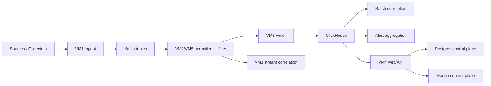

# Debugging And Operational Verification

## Baseline Health Endpoints

Check these first on `VM4`:

- `/api/health/overview`
- `/api/health/transport`
- `/api/health/storage`
- `/api/health/storage-ha`
- `/api/control-plane/storage`
- `/api/content/storage`

## Runtime Flow



## VM1 Ingest

```bash
systemctl is-active siem-ingest nginx
curl -sk https://127.0.0.1/health
journalctl -u siem-ingest -n 100 --no-pager
```

Check:

- Kafka publish errors
- DLQ growth
- ingest response latency

## VM2 And VM5 Processing

```bash
systemctl is-active siem-kafka siem-normalizer siem-normalizer@2 siem-filter siem-filter@2
journalctl -u siem-normalizer -n 100 --no-pager
journalctl -u siem-filter -n 100 --no-pager
```

Healthy signs:

- workers keep consuming
- no sustained Kafka consumer lag
- no repeated parse failures

## VM3 Storage / Detection

```bash
systemctl is-active clickhouse-server siem-writer siem-writer@2 siem-stream-corr siem-batch-corr siem-alert-agg
clickhouse-client --query "SELECT max(ts), count() FROM siem.events WHERE ts > now() - INTERVAL 10 MINUTE"
clickhouse-client --query "SELECT max(ts), count() FROM siem.alerts_raw WHERE ts > now() - INTERVAL 24 HOUR"
journalctl -u siem-writer -n 100 --no-pager
journalctl -u siem-stream-corr -n 100 --no-pager
```

Check:

- writer freshness into `siem.events`
- stream correlation event-time runtime
- SQLite state path health
- ClickHouse memory pressure

## VM4 Web / Control Plane

```bash
systemctl is-active siem-web nginx postgresql mongod
curl -sk -o /dev/null -w '%{http_code}\n' https://127.0.0.1/auth/login
curl -sk -o /dev/null -w '%{http_code}\n' https://127.0.0.1/app
journalctl -u siem-web -n 200 --no-pager
```

Check:

- `/api/health/transport`
- `/api/health/storage-ha`
- `/api/auth/permissions`
- `/api/vuln/runtime`

## End-To-End Failure Isolation

### No fresh events

1. Check `VM1` ingest logs.
2. Check Kafka health and topic lag.
3. Check `VM2/VM5` consumer logs.
4. Check `VM3` writer logs and `siem.events`.

### No fresh alerts

1. Check `VM3` `siem-stream-corr`.
2. Check `siem.stream_corr_runtime_status`.
3. Check `siem.alerts_raw`.

### Control plane unhealthy

1. Check `/api/control-plane/storage` for Postgres state.
2. Check `/api/content/storage` for Mongo state.
3. Check `postgresql` and `mongod` systemd units.

### Host telemetry stale

1. Check `siem-host-runtime-agent.timer` on all nodes.
2. Check `siem-host-runtime-monitor.timer` on `VM4`.
3. Check `/api/health/overview.host_runtime`.

## Current Truth

- transport backend: `kafka`
- stream state backend: `sqlite`
- control-plane backend: `postgres`
- content backend: `mongo`
- Redis is retired from the live runtime path

Historical Redis incident docs remain in the repo only as archival references.
