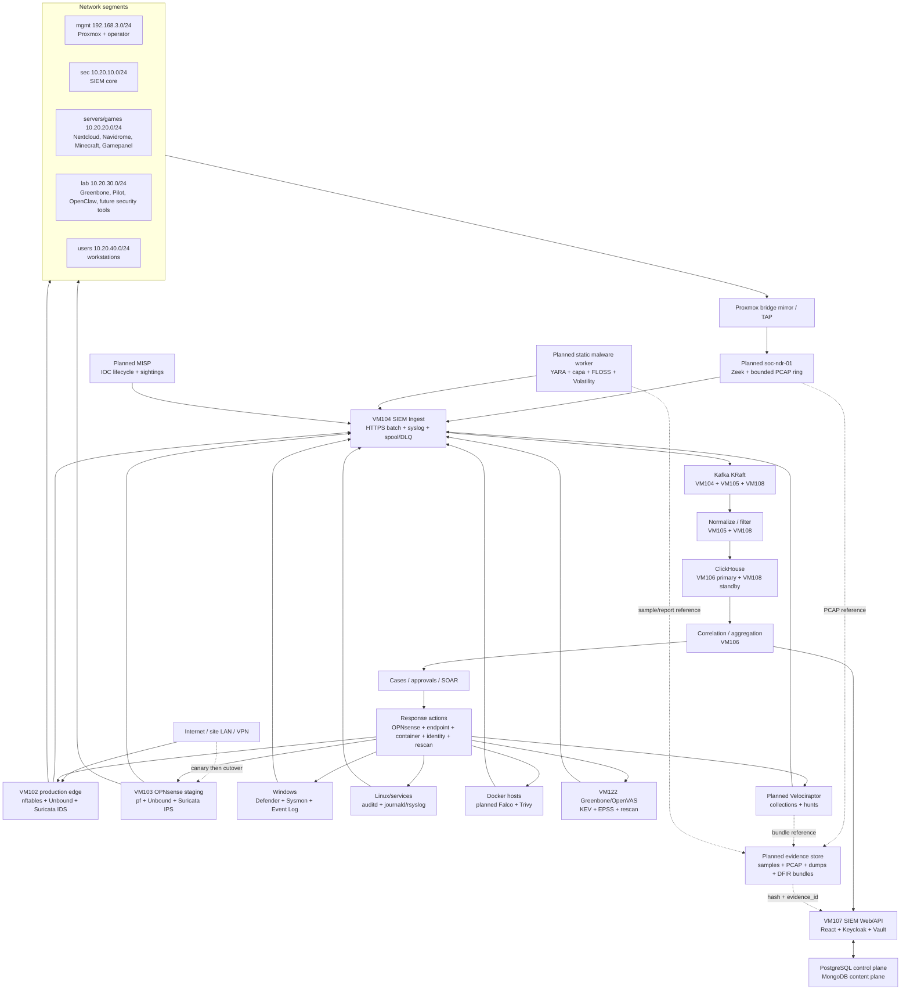

# Домашняя SOC-платформа: текущее состояние и целевая архитектура

Дата: 2026-07-26.

## Назначение

Платформа предназначена для домашнего изучения и полуавтоматического анализа:

- сетевых атак и подозрительных соединений;
- вредоносных файлов и поведения программ;
- событий Windows, Linux, контейнеров и прикладных сервисов;
- уязвимостей, эксплуатируемости и результатов исправления;
- действий учетных записей, операторов и средств автоматизации;
- расследований, threat hunting и отработки response-playbooks.

Главным пользовательским и аналитическим контуром остается собственная SIEM.
Новые продукты не должны создавать параллельные инциденты, отдельную CMDB или
вторую SOAR. Они выступают сенсорами, анализаторами или исполнителями, а их
результаты нормализуются, коррелируются и отображаются в SIEM.

## Что должно поступать в SIEM

В Kafka и ClickHouse поступают:

- события и алерты источников;
- сетевые flow/protocol metadata;
- процессы, пользователи, файлы, хеши и IOC;
- результаты сканирования уязвимостей, SBOM и проверки образов;
- результаты YARA, static/dynamic malware analysis и DFIR-коллекций;
- статусы источников, потери, lag и ошибки;
- все автоматические и ручные response-действия;
- ссылки на доказательства и их контрольные суммы.

Крупные бинарные данные нельзя складывать в таблицу событий:

- образцы вредоносных файлов;
- PCAP;
- memory dumps;
- дисковые образы;
- полные DFIR bundles;
- большие sandbox artifacts.

Они должны храниться в изолированном evidence/object store. SIEM хранит
`evidence_id`, SHA-256, размер, MIME/type, источник, время, цепочку хранения,
retention, разрешения и ссылку на объект. Так все данные доступны из SIEM, но
транспорт событий не используется как файловое хранилище.

## Уже развернуто

| Контур | Компоненты | Состояние |
| --- | --- | --- |
| Сегментация | `mgmt`, `sec`, `servers/games`, `lab`, `users` | Развернуто |
| Production gateway | VM102 `lab-edge-01`, nftables, Unbound | Работает, временный основной шлюз |
| NGFW/IPS | VM103 OPNsense 26.7.1_1, Suricata 8 | Работает в staging на адресах `.254`, production hosts через него еще не маршрутизируются |
| Network IDS | Suricata 7 на VM102, ET Open, EVE | Работает на routed interfaces, передает события в SIEM |
| Ingest | VM104, HTTPS/HTTP batch, syslog TCP/UDP, source identity | Работает |
| Transport | Kafka KRaft на VM104, VM105, VM108 | Работает, три broker/controller; TLS/SASL еще не включены |
| Processing | normalizer/filter на VM105, standby workers на VM108 | Работает |
| Storage | ClickHouse primary VM106, standby VM108 | Работает |
| Detection | stream correlation, batch correlation, alert aggregation | Работает на VM106 |
| Web/control plane | React, API, PostgreSQL, MongoDB | Работает на VM107 |
| Identity/secrets | Keycloak OIDC, Vault | Работает на VM107 |
| Cases/SOAR | Кейсы, задачи, approvals, response actions, audit trail | Работает в собственной SIEM |
| Windows telemetry | Defender, Sysmon, Security, PowerShell, Task Scheduler, WMI, WinRM | Поступает в SIEM |
| Linux telemetry | auditd, journald/rsyslog, service/runtime telemetry | Поступает от большинства Linux-хостов |
| Vulnerability management | Greenbone/OpenVAS VM122, CMDB target sync, KEV, EPSS, SLA, targeted rescan | Работает |
| Source applications | Proxmox, Nextcloud, Navidrome, Minecraft, Gamepanel/Wings, Gitea pilot, OpenClaw, SIEM nodes | События поступают в SIEM |
| Remote access | OpenVPN/reverse tunnel, Proxmox WireGuard service | OpenVPN работает; WireGuard без актуального подтвержденного handshake |
| Source control | Private GitHub repository, runners, deployment scripts | Работает |

Runtime inventory на 2026-07-25 показывал 18 здоровых источников из 18,
22 коллектора из 22, три Kafka broker/controller, активную stream correlation
и свежие события от основных сервисов.

## Чего не хватает

### 1. Полная сетевая видимость

Suricata на VM102 и VM103 анализирует routed traffic. Трафик между двумя
гостями на одном Proxmox bridge может не пройти через маршрутизатор.

Нужно:

- bridge mirror/TAP для `sec`, `servers/games`, `lab` и при необходимости
  `users`;
- отдельный Zeek sensor для `conn`, DNS, HTTP, TLS, SSH, files, software,
  notices и protocol metadata;
- `Community ID` в Suricata, Zeek и SIEM для связывания одной сессии;
- ограниченный PCAP ring buffer на отдельном диске с короткой retention.

Zeek дополняет Suricata: Suricata отвечает за signature/IPS, Zeek за
protocol metadata и hunting. Второй Suricata на sensor VM не нужен.

### 2. Endpoint DFIR и threat hunting

Sysmon, Defender и auditd дают события, но не дают централизованного
forensic collection и управляемых hunts.

Нужно развернуть один Velociraptor server и клиентов на Windows/Linux:

- process, persistence, scheduled task, service и autorun collection;
- targeted file acquisition;
- memory/process triage;
- hunts по группе активов;
- передача summaries и detections в SIEM;
- хранение больших collection bundles в evidence store.

Velociraptor не заменяет SIEM и не должен становиться основным incident UI.

### 3. Анализ вредоносных файлов

На текущей ноде допустим отдельный on-demand static-analysis worker:

- ClamAV;
- YARA;
- capa;
- FLOSS;
- oletools и PDF analysis;
- pefile/LIEF;
- Chainsaw для EVTX;
- Volatility 3 для memory dumps;
- hash/metadata extraction;
- безопасный Nuclei/testssl validation для связанных Web-кейсов.

Поток:

```text
sample -> quarantine -> SHA-256 -> static analyzers
       -> normalized findings/IOC -> SIEM
       -> binary/report -> evidence store
       -> case/timeline -> approved follow-up
```

Полноценный CAPE detonation нельзя считать безопасным на том же физическом
хосте, где находятся SIEM, Keycloak, Vault и production-сервисы. CAPE controller
и disposable Windows guests следует разместить на будущей отдельной 64-ГБ ноде
в изолированном detonation segment без маршрута к `mgmt` и `sec`. CAPE использует
KVM guests и должен восстанавливать их из clean snapshot после каждого анализа.

### 4. Container и supply-chain security

Нужно:

- Trivy в GitHub CI и по расписанию для images, repositories, filesystem,
  vulnerabilities, secrets, misconfiguration и SBOM;
- Falco только на Docker/container hosts для runtime syscall detections;
- подпись образов и проверка provenance;
- нормализаторы `trivy` и `falco` в SIEM;
- связь findings с CMDB asset, image digest, repository и deployment.

Не нужно одновременно добавлять Grype и второй runtime sensor без отдельного
покрытия: это создаст дубли findings.

### 5. Threat intelligence

Текущий контур имеет CISA KEV, EPSS и прикладные IOC, но не полноценный TIP.

Для домашней платформы достаточно одного MISP:

- curated feeds, taxonomies, confidence и expiration;
- IOC lifecycle и sightings;
- экспорт только активных и достаточно надежных IOC в SIEM;
- обратная регистрация sightings из Suricata, Zeek, endpoint и malware
  analysis.

MISP и OpenCTI одновременно не нужны. На первом этапе выбирается MISP, а
собственная SIEM остается местом корреляции и расследования.

### 6. Evidence store

Нужен отдельный S3-compatible или файловый immutable store на выделенном
зашифрованном диске:

- bucket/namespace по типам доказательств;
- SHA-256 и malware-safe MIME handling;
- object retention и lifecycle;
- запрет исполнения и публикации;
- доступ только через service identity;
- backup на физически отдельный носитель.

PostgreSQL хранит case/evidence metadata. MongoDB хранит документы и контент.
ClickHouse хранит searchable security events. Evidence store хранит большие
объекты. Эти роли не дублируются.

### 7. Управляемое реагирование

Нужно расширить существующий SOAR следующими действиями:

- временная блокировка IP/domain/hash через OPNsense;
- изоляция endpoint через host firewall;
- Defender scan/quarantine на Windows;
- targeted Velociraptor collection;
- остановка и quarantine контейнера;
- блокировка/сброс сессий Keycloak;
- snapshot VM перед исправлением;
- package remediation и rollback;
- targeted Greenbone/Nuclei rescan;
- снятие блокировки по TTL;
- запись stdout/stderr, actor, approval и результата в SIEM.

Автоматически без approval допустимы enrichment, сбор доказательств,
безопасное сканирование и краткоживущая блокировка подтвержденного IOC.
Изменения пакетов, сервисов, учетных записей и сетевой доступности требуют
approval и rollback plan.

### 8. Защита самой платформы

Нужно:

- перевести Kafka с `PLAINTEXT` на TLS/SASL;
- ввести service identity и mTLS между ingest, processing, storage и Web;
- развернуть internal PKI с offline root и online intermediate;
- удалить legacy `192.168.1.x` aliases после проверки всех consumers;
- завершить canary и controlled promotion OPNsense;
- хранить backup не на том же физическом Proxmox;
- регулярно проверять restore;
- добавить независимый health-monitor на будущую вторую ноду.

## Что нужно доработать в SIEM

### Data plane

1. Ввести canonical security schema:
   `event.kind/category/type/action/outcome`, `observer`, `sensor`, `asset_id`,
   `user`, `process`, `file`, `hash`, `src/dst`, `network.community_id`,
   `container`, `vulnerability`, `threat`, `case_id`, `evidence_id`.
2. Добавить versioned adapters для Zeek, Velociraptor, Falco, Trivy, YARA/CAPE,
   MISP и OPNsense.
3. Для тяжелых источников использовать batch ingest, local spool,
   backpressure и DLQ.
4. В ClickHouse разделить hot event search, network flows, findings и
   long-retention summaries.
5. Не передавать бинарные artifacts через Kafka.

### Detection plane

Нужны cross-domain правила:

- Suricata alert + Zeek session + endpoint process;
- download/file observation + hash + YARA + process execution;
- exploitable vulnerability + matching exploit traffic;
- unusual Keycloak login + PowerShell/WMI/process activity;
- container shell/privilege change + unusual egress;
- newly observed service + vulnerability + public exposure;
- repeated failed response action или sensor coverage loss.

Каждое правило должно иметь asset scope, threshold/window, dedup key,
suppression, synthetic true-positive fixture и historical replay.

### Analyst plane

В Web нужно добавить:

- единый investigation timeline;
- переходы event -> session -> process -> file -> vulnerability -> case;
- network session view с Suricata и Zeek evidence;
- endpoint/DFIR workbench;
- malware sample workbench без прямой выдачи файла браузеру;
- threat-intelligence карточку IOC и sightings;
- evidence chain-of-custody;
- response plan, approvals, execution log и rollback;
- source coverage и data-quality dashboard.

## Размещение на текущей ноде

Текущий Proxmox имеет 48 logical CPU и около 165 ГиБ RAM. Он остается главным
узлом, но новые роли вводятся по одной с обязательным резервом памяти для
Proxmox, ZFS/page cache и восстановления.

| Новая роль | Рекомендуемый старт | Режим |
| --- | ---: | --- |
| `soc-ndr-01` / Zeek | 6 vCPU, 8-12 ГиБ, отдельный 150-300 ГиБ disk | Always-on после mirror/TAP |
| `soc-dfir-01` / Velociraptor | 4 vCPU, 8 ГиБ, 100-200 ГиБ disk | Always-on |
| `soc-analysis-01` / static malware tools | 8 vCPU, 12-16 ГиБ, encrypted 150-300 ГиБ disk | On-demand |
| `soc-ti-01` / MISP | 4 vCPU, 8 ГиБ, 100 ГиБ disk | После NDR/DFIR |
| `soc-pki-01` / online intermediate | 2 vCPU, 2-4 ГиБ, 20 ГиБ disk | Always-on; root offline |
| Evidence store | 4 vCPU, 8 ГиБ, отдельный объем по retention | После выбора отдельного диска/backup |
| OpenCanary | 1-2 vCPU, 1-2 ГиБ | Опционально в изолированном `lab` |

Не следует одновременно резервировать все эти ресурсы. Порядок: NDR, DFIR,
static analysis, PKI/evidence, TI. После каждого шага проверяются memory
pressure, ClickHouse latency, Kafka lag и UI p95.

Будущая 32-ГБ нода подходит для Zeek/PCAP sensor или независимого monitoring/
backup proxy. Будущая 64-ГБ нода должна стать isolated CAPE/detonation node.

## Карта сервисов



## Целевой путь расследования

```text
attack or suspicious file
        |
        +-- network: OPNsense/Suricata + Zeek
        +-- endpoint: Defender/Sysmon/auditd/Velociraptor
        +-- workload: Falco/application logs
        +-- exposure: Greenbone/Trivy/Nuclei
        +-- intelligence: MISP/KEV/EPSS
        |
        v
SIEM ingest -> Kafka -> normalization -> ClickHouse
        |
        v
cross-domain correlation -> incident -> investigation timeline
        |
        +-- evidence acquisition -> evidence store
        +-- static/dynamic analysis -> findings and IOC
        +-- enrichment -> asset, identity, vulnerability, threat context
        |
        v
case -> approved response -> verification/rescan -> closure
        |
        v
all actions and results return to SIEM
```

## Порядок реализации

### Wave 0: foundation

1. Закончить OPNsense canary policy и controlled gateway cutover.
2. Включить Kafka TLS/SASL и service identities.
3. Подготовить external backup/evidence disk и проверить restore.
4. Зафиксировать canonical schema и contract tests для новых источников.

### Wave 1: visibility

1. Развернуть bridge mirror/TAP.
2. Развернуть Zeek и передавать JSON batches в ingest.
3. Добавить Community ID и network investigation view.
4. Проверить packet loss и EPS до включения всех Zeek logs.

### Wave 2: endpoint response

1. Развернуть Velociraptor server.
2. Подключить сначала `WIN-RTX-test` и один Linux canary.
3. Интегрировать collection summaries, evidence и hunts в SIEM.
4. Добавить approved isolation/collection playbooks.

### Wave 3: malware and workload security

1. Создать quarantine/evidence store.
2. Развернуть static-analysis worker.
3. Добавить Trivy в CI и Falco на одном Docker canary host.
4. Построить file/hash/process/container correlation.

### Wave 4: threat intelligence

1. Развернуть MISP.
2. Включить только curated feeds с confidence, TTL и source.
3. Реализовать IOC sightings и автоматическое истечение блокировок.

### Wave 5: isolated detonation

1. Подготовить отдельную 64-ГБ physical node.
2. Создать полностью изолированный detonation segment.
3. Развернуть CAPE и disposable Windows guests.
4. Передавать в SIEM только reports, behavior, IOC и artifact references.

## Что не нужно разворачивать

- Security Onion, Elastic SIEM, Wazuh manager или второй ClickHouse/Elastic
  аналитический стек как отдельную SOC-платформу;
- TheHive/Shuffle как второй case/SOAR;
- NetBox как вторую CMDB до появления требований, которых не покрывает
  текущий asset inventory;
- MISP и OpenCTI одновременно;
- второй vulnerability manager параллельно Greenbone;
- Arkime до появления отдельного packet-storage бюджета;
- CAPE на том же физическом хосте, где находятся SIEM identity/secrets и
  основные сервисы.

## Основные источники проектных решений

- Zeek monitoring and investigation model:
  https://docs.zeek.org/en/current/monitoring.html
- Velociraptor hunts and endpoint collection:
  https://docs.velociraptor.app/docs/hunting/
- Greenbone architecture:
  https://greenbone.github.io/docs/latest/architecture.html
- CAPE KVM configuration:
  https://capev2.readthedocs.io/en/latest/installation/host/configuration.html
- Trivy repository/SBOM scanning:
  https://trivy.dev/docs/latest/target/repository/
- Falco rules:
  https://falco.org/docs/reference/rules/default-rules/
- MISP documentation:
  https://www.misp-project.org/documentation/
- Internal PKI:
  https://smallstep.com/docs/step-ca/
