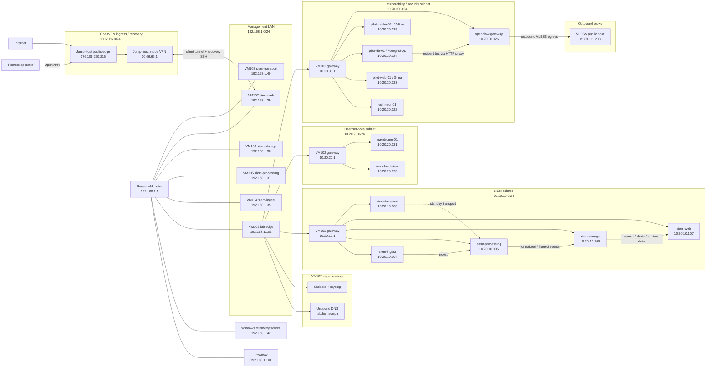

# Live Service Placement And Network Topology: 2026-04-01

## Purpose

This document is the current-state map of where the services live after the `2026-04-01` segmentation wave.

Use this document as the fast answer to:

- which VM or CT currently hosts each service
- which IP or DNS name is current
- how the segmented networks connect to each other
- how remote access works through `OpenVPN`
- where the outbound `VLESS` egress sits

Reading rule:

- for `SIEM` nodes, both `192.168.1.x` management IPs and `10.20.10.x` segmented IPs are current
- for non-SIEM platform services, the segmented `10.20.x.x` addresses are the authoritative current addresses
- a few older operator docs still contain historical `192.168.1.x` pilot-service references; this document prefers the segmented live state

## Current Network Zones

| Zone | CIDR | Gateway | Current purpose |
| --- | --- | --- | --- |
| `mgmt` | `192.168.1.0/24` | household router `192.168.1.1` | Proxmox management, SIEM management IPs, legacy LAN path |
| `siem` | `10.20.10.0/24` | `10.20.10.1` on `VM102` | internal SIEM runtime network |
| `users` | `10.20.20.0/24` | `10.20.20.1` on `VM102` | user-facing internal services |
| `vuln` | `10.20.30.0/24` | `10.20.30.1` on `VM102` | vulnerability, pilot, and security-side services |
| `vpn` | `10.66.66.0/24` | jump-host OpenVPN server | remote operator ingress and recovery path |

## Current Service Placement

| Zone | Node | Current IP / DNS | Main services now on the node | Role |
| --- | --- | --- | --- | --- |
| `mgmt + edge` | `VM102 lab-edge-01` | `192.168.1.102`, `10.20.10.1`, `10.20.20.1`, `10.20.30.1`, `lab-edge-mgmt.lab.home.arpa` | `Unbound`, `nftables`, `Suricata`, `rsyslog` | routed edge, local DNS, inter-subnet gateway |
| `mgmt + siem` | `VM104 siem-ingest` | `192.168.1.35`, `10.20.10.104`, `siem-ingest.lab.home.arpa` | `nginx`, `siem-ingest` | ingest edge and collector entry |
| `mgmt + siem` | `VM105 siem-processing` | `192.168.1.37`, `10.20.10.105`, `siem-processing.lab.home.arpa` | `siem-kafka`, `siem-normalizer`, `siem-normalizer@2`, `siem-filter`, `siem-filter@2` | processing plane |
| `mgmt + siem` | `VM106 siem-storage` | `192.168.1.38`, `10.20.10.106`, `siem-storage.lab.home.arpa` | `clickhouse-server`, `siem-writer`, `siem-writer-shadow`, `siem-stream-corr`, `siem-batch-corr`, `siem-alert-agg` | storage and detection plane |
| `mgmt + siem + vpn` | `VM107 siem-web` | `192.168.1.39`, `10.20.10.107`, `siem-web.lab.home.arpa` | `nginx`, `siem-web`, `siem-vault`, `siem-keycloak`, `postgresql`, `mongod`, `openvpn-client@home-gateway`, `siem-jump-tunnels` | web/control plane and access-plane anchor |
| `mgmt + siem` | `VM108 siem-transport` | `192.168.1.40`, `10.20.10.108`, `siem-transport.lab.home.arpa` | Kafka and standby transport/runtime services | standby transport plane |
| `users` | `CT120 nextcloud-siem` | `10.20.20.120`, `nextcloud-siem.lab.home.arpa` | `apache2`, `mariadb`, `redis-server`, `fail2ban`, `webmin`, `ssh`, `rsyslog` | collaboration and file service |
| `users` | `CT121 navidrome-01` | `10.20.20.121`, `navidrome-01.lab.home.arpa` | `nginx`, `oauth2-proxy`, `navidrome`, `rdegon-vuln-scan.timer`, `ssh`, `rsyslog` | media service with browser SSO proxy |
| `vuln` | `VM122 vuln-mgr-01` | `10.20.30.122`, `vuln-mgr-01.lab.home.arpa` | `docker`, `OpenVAS/Greenbone runtime`, `auditd`, `ssh`, `rsyslog` | vulnerability manager and scanner control |
| `vuln` | `VM123 pilot-web-01` | `10.20.30.123`, `pilot-web-01.lab.home.arpa` | `docker`, `pilot-gitea`, `auditd`, `ssh`, `rsyslog` | `Gitea` pilot web service |
| `vuln` | `VM124 pilot-db-01` | `10.20.30.124`, `pilot-db-01.lab.home.arpa` | `postgresql@14-main`, `incident-telegram-bot`, `auditd`, `ssh`, `rsyslog` | pilot database and incident bot host |
| `vuln` | `VM125 pilot-cache-01` | `10.20.30.125`, `pilot-cache-01.lab.home.arpa` | `docker`, `pilot-valkey`, `auditd`, `ssh`, `rsyslog` | cache / queue helper |
| `vuln + egress` | `VM126 openclaw-gateway` | `10.20.30.126`, `openclaw-gateway.lab.home.arpa` | `openclaw-gateway`, `openclaw-vless`, `auditd`, `systemd-resolved`, `ssh`, `rsyslog` | OpenClaw gateway and outbound `VLESS` egress |
| `mgmt` | `Proxmox host` | `192.168.1.101` | Proxmox VE and fleet source of truth | hypervisor and inventory source |
| `mgmt` | `Household router` | `192.168.1.1` | upstream routing only | upstream gateway for `192.168.1.0/24` |
| `mgmt` | `Windows workstation` | `192.168.1.42` | Windows endpoint telemetry source | monitored source |
| `out of scope` | `VM111 WIN-RTX-test` | unchanged | workstation / GPU box | intentionally not part of this platform map |

## Current VPN And Access Paths

| Path | Current endpoint(s) | What it does |
| --- | --- | --- |
| `OpenVPN ingress` | jump-host public `176.108.250.215`, VPN-side `10.66.66.1` | primary remote operator ingress into the homelab |
| `OpenVPN client` | `VM107` service `openvpn-client@home-gateway` | keeps the lab side attached to the jump-host VPN |
| `Recovery reverse SSH` | `VM107` service `siem-jump-tunnels` | exposes SSH recovery ports on the jump-host for `VM102`, `VM104-108`, `CT120-121`, `VM122-126` |
| `Split tunnel routes` | operator profile routes `10.20.10.0/24`, `10.20.20.0/24`, `10.20.30.0/24`, selected `192.168.1.x` hosts | makes every current platform node reachable after VPN attach |
| `Outbound VLESS egress` | `VM126 -> 45.89.111.208` | external proxy / egress path for OpenClaw-side traffic and dependent automation |

Supported remote-access rule in the current stand:

- web UIs are private only
- SSH to the jump-host is VPN-only
- the public edge that remains exposed is the jump-host `OpenVPN` listener

## Local DNS Map

Current local DNS authority lives on `VM102 / Unbound`.

| DNS name | Current target |
| --- | --- |
| `siem-ingest.lab.home.arpa` | `10.20.10.104` |
| `siem-processing.lab.home.arpa` | `10.20.10.105` |
| `siem-storage.lab.home.arpa` | `10.20.10.106` |
| `siem-web.lab.home.arpa` | `10.20.10.107` |
| `siem-transport.lab.home.arpa` | `10.20.10.108` |
| `nextcloud-siem.lab.home.arpa` | `10.20.20.120` |
| `navidrome-01.lab.home.arpa` | `10.20.20.121` |
| `vuln-mgr-01.lab.home.arpa` | `10.20.30.122` |
| `pilot-web-01.lab.home.arpa` | `10.20.30.123` |
| `pilot-db-01.lab.home.arpa` | `10.20.30.124` |
| `pilot-cache-01.lab.home.arpa` | `10.20.30.125` |
| `openclaw-gateway.lab.home.arpa` | `10.20.30.126` |
| `siem-gw.lab.home.arpa` | `10.20.10.1` |
| `users-gw.lab.home.arpa` | `10.20.20.1` |
| `vuln-gw.lab.home.arpa` | `10.20.30.1` |

## Network Topology

## Operational Notes

- `VM104-108` remain dual-homed because the SIEM is being moved gradually onto the segmented runtime network.
- `CT120-121` and `VM122-126` should be treated as `10.20.x.x` systems first; older `192.168.1.x` references for these nodes are historical.
- The current supported operator path to every segmented machine is `OpenVPN -> jump-host -> routed lab networks`.
- Direct access from arbitrary `192.168.1.x` LAN clients to `10.20.10.0/24`, `10.20.20.0/24`, and `10.20.30.0/24` still depends on static routes on the upstream household router.
