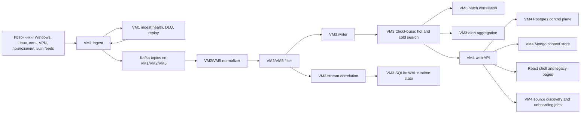

# Единый бриф для агента: SIEM, дизайн, UX и продуктовые требования

Дата фиксации: `2026-04-21`

Назначение файла: передать другому агенту полный рабочий контекст по SIEM-системе, ее архитектуре, пользовательскому интерфейсу, требованиям к дизайну, критериям приемки и правилам дальнейшей доработки.

Файл намеренно не содержит паролей, токенов, приватных ключей и operator bundle-секретов. Для задач дизайна, UX, фронтенда, документации и продуктовой спецификации они не нужны. Если агенту потребуется доступ к live-стенду, он должен запросить отдельный безопасный канал доступа у владельца проекта, а не искать и копировать секреты из репозитория.

## 1. Краткое резюме

Проект представляет собой веб-ориентированную SIEM/SOC-платформу под названием `Rdegon Sentinel`. Это не лендинг, не маркетинговый сайт и не простая админ-панель. Целевой интерфейс - рабочая консоль оператора SOC, предназначенная для:

1. централизованного приема событий информационной безопасности;
2. нормализации, фильтрации и корреляции телеметрии;
3. поиска и расследования событий;
4. triage и сопровождения инцидентов;
5. управления активами, сущностями, источниками, коллекторами и коннекторами;
6. анализа уязвимостей и киберразведки;
7. управления доступом, service accounts, API tokens и секретами;
8. запуска и контроля действий реагирования;
9. наблюдения за состоянием узлов, transport/storage/runtime-слоев;
10. предоставления встроенной документации, runbook и operator-facing знаний.

Главная продуктовая установка: интерфейс должен помогать аналитику понять, что происходит, где риск, что требует действия и куда перейти дальше. Система должна выглядеть как инструментальный центр киберопераций: строгая темная тема, высокая плотность, стабильная навигация, ясная иерархия, минимум декоративности, максимум операционного смысла.

## 2. Основные источники контекста

Перед началом работ агент должен прочитать минимум эти файлы:

1. `repo/docs/architecture.md` - архитектура стенда, потоки данных, VM-роли, backend/runtime-контуры.
2. `repo/docs/siem_design_requirements_2026-04-21.md` - отдельная спецификация требований к дизайну.
3. `repo/docs/ui_ux_system_audit_2026-03-27.md` - подробный UI/UX-аудит текущего продукта.
4. `repo/docs/app_section_guide_and_usability_2026-03-28.md` - назначение разделов `/app/*`, пользователи, UX-оценки.
5. `repo/docs/platform_finalization_and_app_redesign_2026-03-27.md` - что изменилось при финализации платформы и редизайне `/app`.
6. `repo/docs/diploma/rdegon_siem_diploma_documentation_2026-03-28.md` - дипломная формулировка цели, задач, подсистем и пользовательского интерфейса.
7. `repo/frontend-react/src/shell/App.tsx` - навигация, shell, маршруты, группировка разделов.
8. `repo/frontend-react/src/styles/tokens.css` и соседние CSS-файлы - визуальная система и слои стилей.
9. `repo/frontend-react/src/shell/api.ts` и `repo/frontend-react/src/shell/types.ts` - frontend API-контракты.
10. `repo/frontend-react/src/shell/pages/*` - страницы рабочих зон.

Если этот handoff конфликтует с более свежими файлами в репозитории, агент должен считать более свежий код и документацию источником истины, но не игнорировать изложенные здесь продуктовые требования.

## 3. Текущее расположение проекта

Локальный workspace:

```text
C:\Users\Rdegon\Projects\siem_xfer_2026-03-25
```

Основной репозиторий:

```text
C:\Users\Rdegon\Projects\siem_xfer_2026-03-25\repo
```

Фронтенд:

```text
C:\Users\Rdegon\Projects\siem_xfer_2026-03-25\repo\frontend-react
```

Документация:

```text
C:\Users\Rdegon\Projects\siem_xfer_2026-03-25\repo\docs
```

Live web slice на VM4, согласно архитектурной документации:

```text
/opt/siem/siem-solution/services/web
```

Важно: в рабочем дереве уже могут быть незакоммиченные изменения, не сделанные текущим агентом. Агент не должен делать `git reset --hard`, `git checkout --` или иные откаты без явного разрешения владельца. Если файл уже изменен, надо прочитать его и работать поверх текущего состояния.

## 4. Архитектура стенда

Система развернута как распределенный стенд из пяти основных VM.

| Узел | Адрес | Назначение |
| --- | --- | --- |
| `VM1` | `192.168.1.35` | Ingest edge: syslog, HTTP collectors, ingress health |
| `VM2` | `192.168.1.37` | Kafka and processing: normalizer, filter |
| `VM3` | `192.168.1.38` | Storage and detection: ClickHouse, writer, stream correlation, batch correlation, alert aggregation, SQLite runtime state |
| `VM4` | `192.168.1.39` | Web/API/React UI, docs, reports, Postgres control plane, Mongo content plane |
| `VM5` | `192.168.1.40` | Kafka and standby processing/storage services |

Смысл разбиения:

1. `VM1` принимает события и держит edge-health, DLQ и replay на входе.
2. `VM2` и `VM5` выполняют обработку через Kafka, normalizer и filter.
3. `VM3` хранит события в ClickHouse, выполняет correlation и alert aggregation.
4. `VM4` обслуживает web/API, React UI, control plane, identity, docs, content store.
5. `VM5` добавляет standby/резервный контур для transport/processing/storage.

## 5. Сквозной поток данных

Текущий логический pipeline:



В интерфейсе этот поток должен быть понятен через рабочие зоны:

1. источники и коллекторы показывают, откуда идет телеметрия;
2. ingest показывает, как события принимаются, попадают в DLQ и replay;
3. события показывают нормализованный и сырой материал расследования;
4. инциденты и кейсы показывают результат корреляции и triage;
5. активы и сущности дают бизнес-контекст;
6. уязвимости и threat intel расширяют риск-картину;
7. response показывает действия реагирования;
8. host runtime показывает здоровье узлов и компонентов.

## 6. Runtime services и storage

Основные runtime-слои:

| Слой | Сервисы |
| --- | --- |
| Ingest | `nginx`, `siem-ingest` |
| Processing | `siem-kafka`, `siem-normalizer`, `siem-normalizer@2`, `siem-filter`, `siem-filter@2` |
| Storage and detection | `clickhouse-server`, `siem-writer`, `siem-writer@2`, `siem-stream-corr`, `siem-batch-corr`, `siem-alert-agg` |
| Web and UX | `nginx`, `siem-web`, `frontend-react/dist`, `mongod`, `postgresql` |

Хранилища и их смысл:

1. `ClickHouse` - события, alerts, detection catalogs, active lists, threat intel, CMDB assets.
2. `Kafka` - live transport для raw, normalized, filtered, dlq, replay и audit topics.
3. `Postgres` - authoritative control-plane storage после cutover.
4. `MongoDB` - content plane: docs, saved searches, content bundles, dashboard instances, builder drafts.
5. `SQLite WAL` на VM3 - runtime state для stream correlation.

Ключевые Kafka topics:

1. `siem.raw`
2. `siem.normalized`
3. `siem.filtered`
4. `siem.dlq`
5. `siem.replay`
6. `siem.transport.audit`

Ключевые consumer groups:

1. `siem-normalizer`
2. `siem-filter`
3. `siem-writer`
4. `siem-stream-corr`

Дизайн должен показывать не только факт ошибки, но и слой ошибки: source, collector, ingest, transport, processing, storage, API, UI.

## 7. Продуктовая цель

Цель системы, в дипломной формулировке: разработка веб-ориентированной системы мониторинга событий информационной безопасности, обеспечивающей централизованный сбор, хранение, обработку, сопоставление и анализ событий, разграничение доступа пользователей и предоставление единой операторской среды для наблюдения за состоянием инфраструктуры и реагирования на инциденты.

Практическая цель интерфейса:

1. дать SOC-аналитику понятное рабочее место;
2. позволить быстро перейти от высокого уровня к конкретному событию;
3. связать технические события с активами, сущностями, уязвимостями и инцидентами;
4. снизить время triage;
5. показать, где деградирует платформа;
6. обеспечить безопасные действия реагирования;
7. поддерживать дипломную демонстрацию, но не выглядеть как учебный mock.

## 8. Главный UX-принцип

Каждая страница должна отвечать на три вопроса:

1. Что сейчас важно?
2. Почему это важно?
3. Что оператор может сделать дальше?

Если блок не помогает ответить хотя бы на один из этих вопросов, он должен быть:

1. перенесен ниже;
2. свернут;
3. превращен в secondary tab;
4. удален;
5. заменен на более actionable представление.

## 9. Персоны

### SOC-аналитик

Основные задачи:

1. смотреть общее состояние;
2. triage инцидентов;
3. искать события;
4. открывать детали;
5. связывать событие с активом, сущностью, инцидентом и кейсом;
6. отличать реальную угрозу от шума.

Нужны:

1. быстрый обзор;
2. таблица событий с фильтрами;
3. очередь инцидентов;
4. linked context;
5. сохранение фильтров;
6. понятные severity/status.

### Incident responder

Основные задачи:

1. принять инцидент в работу;
2. создать или обновить кейс;
3. собрать доказательства;
4. запустить или подтвердить response action;
5. зафиксировать результат;
6. закрыть или эскалировать.

Нужны:

1. статус и владелец;
2. evidence blocks;
3. action queue;
4. approval flow;
5. audit trail;
6. понятное восстановление после ошибки действия.

### Detection engineer

Основные задачи:

1. анализировать срабатывания правил;
2. работать с корреляционными наборами;
3. проверять saved searches;
4. оценивать ложноположительные срабатывания;
5. создавать и поддерживать content packs.

Нужны:

1. Events;
2. Builders;
3. Threat Intel;
4. связь rules -> events -> incidents;
5. возможность preview/dry-run там, где это реализовано.

### Platform administrator

Основные задачи:

1. следить за runtime health;
2. настраивать источники и коллекторы;
3. управлять доступом;
4. контролировать секреты;
5. смотреть storage/transport readiness;
6. выполнять эксплуатационные runbook.

Нужны:

1. Host Runtime;
2. Ingest;
3. Sources;
4. Collectors;
5. Connectors;
6. Access;
7. Documentation.

### Vulnerability analyst

Основные задачи:

1. смотреть результаты сканирования;
2. сопоставлять findings с активами;
3. приоритизировать remediation;
4. видеть exposure;
5. связывать уязвимости с инцидентами и телеметрией.

Нужны:

1. Vulnerability workspace;
2. asset mapping;
3. severity and exposure priority;
4. unmapped target queue;
5. action-first top section.

### Reviewer / руководитель / проверяющий

Основные задачи:

1. понять архитектуру;
2. увидеть целостность стенда;
3. проверить, что система выглядит завершенной;
4. оценить зрелость интерфейса;
5. увидеть performance evidence и live state.

Нужны:

1. Overview;
2. Documentation;
3. Health surfaces;
4. понятная структура приложения;
5. не перегруженный первый экран.

## 10. Текущая frontend-архитектура

Фронтенд находится в:

```text
repo/frontend-react
```

Технологии:

1. React 18.
2. React Router 6.
3. TypeScript.
4. Vite/Storybook tooling.
5. Recharts.
6. react-simple-maps.
7. CSS layers через отдельные файлы.

Основные файлы:

| Файл | Назначение |
| --- | --- |
| `src/shell/App.tsx` | shell, навигация, маршруты, topbar, sidebar, shortcuts |
| `src/shell/api.ts` | API-клиент и контракты запросов |
| `src/shell/types.ts` | типы данных shell/API |
| `src/shell/surfaces.tsx` | shared surfaces, панели, таблицы, секции |
| `src/shell/charts.tsx` | chart wrappers |
| `src/shell/humanize.ts` | human-friendly formatting |
| `src/shell/runtimeLocalization.ts` | локализация runtime/status терминов |
| `src/shell/investigation.tsx` | investigation-related surfaces |
| `src/styles/tokens.css` | дизайн-токены |
| `src/styles/base.css` | базовая типографика и layout |
| `src/styles/shell.css` | shell chrome |
| `src/styles/components.css` | компоненты |
| `src/styles/data-surfaces.css` | таблицы и плотные data surfaces |
| `src/styles/charts.css` | графики |
| `src/styles/page-families.css` | page-family styling |
| `src/styles/legacy.css` | compatibility layer, по возможности не расширять |

Важно: `legacy.css` подключен для совместимости. Новую работу лучше вести через tokens/base/shell/components/data-surfaces/charts/page-families, а не наращивать legacy.

## 11. Текущие маршруты и рабочие зоны

В `App.tsx` есть такие основные route/page соответствия:

| Route | Страница | Назначение |
| --- | --- | --- |
| `/app/dashboards` | `DashboardPage.tsx` | Обзор SOC и состояния платформы |
| `/app/control` | `ControlPanelPage.tsx` | Компоновка и публикация dashboards/templates/widgets |
| `/app/incidents` | `IncidentsPage.tsx` | Triage, очередь и жизненный цикл инцидентов |
| `/app/events` | `EventsPage.tsx` | Поиск, фильтрация и просмотр событий |
| `/app/assets` | `AssetsPage.tsx` | CMDB, активы, ownership, exposure, telemetry |
| `/app/ingest` | `IngestPage.tsx` | Ingest health, DLQ, replay, runtime issues |
| `/app/sources` | `SourcesPage.tsx` | Источники, discovery, onboarding, fleet state |
| `/app/collectors` | `CollectorsPage.tsx` | Collector pipeline, heartbeat, lag, coverage |
| `/app/connectors` | `ConnectorsPage.tsx` | Runtime connectors, hooks, secrets, integrations |
| `/app/vuln` | `VulnPage.tsx` | Уязвимости, OpenVAS/Greenbone, exposure, remediation |
| `/app/entities` | `EntitiesPage.tsx` | Risk по пользователям, хостам, IP и другим сущностям |
| `/app/cases` | `CasesPage.tsx` | Расследования, evidence, журнал действий |
| `/app/access` | `AccessPage.tsx`, `access/AccessWorkspace.tsx` | Identity control center, Keycloak, grants, service accounts |
| `/app/response` | `ResponsePage.tsx` | SOAR, response queue, approvals, ledger |
| `/app/host-runtime` | `HostRuntimePage.tsx` | Runtime состояние хостов, давление, escalation |
| `/app/threat-intel` | `ThreatIntelPage.tsx` | IOC, reputation, matches, intel sources |
| `/app/builders` | `pages/builders/BuildersWorkbench.tsx` | Content/rule builders, correlation packs |
| `/app/docs` | `DocumentationPage.tsx` | Knowledge base, playbooks, runbooks |

Группы навигации:

1. `Operations`
2. `Data Plane`
3. `Exposure & Intel`
4. `Response & Runtime`
5. `Content & Docs`

Русская operator-facing терминология должна сохраняться:

1. Обзор.
2. Панель управления.
3. Инциденты.
4. События.
5. Активы.
6. Прием данных.
7. Источники.
8. Коллекторы.
9. Коннекторы.
10. Уязвимости.
11. Сущности.
12. Кейсы.
13. Доступ.
14. Оркестрация.
15. Состояние узлов.
16. Киберразведка.
17. Конструкторы.
18. Документация.

## 12. Визуальное направление

Согласно редизайну, shell должен восприниматься как `instrument-grade cyber operations`.

Ключевые характеристики:

1. graphite/navy/ink surfaces;
2. темная тема как основной режим;
3. reserved semantic accents для urgency/state;
4. плотная иерархия без равновесных декоративных карточек;
5. сильные right-side context panels;
6. dense tables, split views, side drawers;
7. графики как операционные инструменты, а не украшение;
8. единый brand: `Rdegon Sentinel`, mark, favicon, IBM Plex Sans, IBM Plex Mono.

Запрещенное или нежелательное направление:

1. маркетинговые hero-блоки внутри рабочей консоли;
2. лендинговая композиция;
3. декоративные SVG/градиентные иллюстрации без пользы;
4. слишком крупные карточки вместо dense operator UI;
5. визуальная однотонность без semantic separation;
6. разрозненная смесь RU/EN без причины;
7. icon-only controls без tooltip/label, если действие не очевидно.

## 13. Глобальные требования к дизайну

1. Интерфейс должен быть рабочей консолью оператора SOC.
2. Первый экран должен отвечать: что происходит, где риск, что требует действия, куда перейти.
3. Навигация должна отражать реальные рабочие зоны SIEM.
4. Каждый раздел должен иметь ясное назначение, основную роль и ведущий workflow.
5. Плотность данных должна быть высокой, но не вредить сканированию.
6. Все критичные действия должны быть связаны с контекстом.
7. Дизайн должен помогать расследованию, а не только показывать метрики.
8. Severity и health должны быть едиными во всех разделах.
9. Empty/error/loading states должны объяснять следующий шаг.
10. Live refresh не должен сбрасывать фильтры, selection, drawer state и позицию пользователя.
11. Секреты нельзя показывать в открытом виде после создания.
12. Опасные действия должны требовать подтверждения и оставлять audit trail.

## 14. Information architecture

Страница должна иметь предсказуемую структуру:

1. page title and role;
2. current status/health;
3. primary metrics;
4. primary working list;
5. selected item context;
6. details/evidence;
7. actions;
8. secondary reference.

Длинные страницы должны избегать "парада блоков". Если страница слишком длинная:

1. оставить сверху только command content;
2. перенести справочные блоки в вкладки;
3. сделать secondary panels;
4. использовать collapse/expand;
5. добавить navigation anchors только если страница все равно длинная;
6. не выводить reference-heavy material выше action-heavy material.

## 15. Entity relationship model для UX

Главная связка расследования:

```text
Source -> Collector -> Event -> Entity -> Asset -> Incident -> Case -> Response Action
```

Дополнительные связи:

```text
Vulnerability -> Asset -> Incident -> Case
Threat Intel IOC -> Event -> Entity -> Incident
Rule / Correlation Pack -> Alert -> Incident -> Case
Service Health -> Runtime Issue -> Runbook
```

Каждая детальная карточка должна по возможности показывать:

1. что это за объект;
2. почему он важен;
3. где он появился;
4. какие связанные объекты есть;
5. какие действия доступны;
6. что изменилось во времени;
7. куда перейти дальше.

## 16. Требования к `/app/dashboards` - Обзор

Назначение: command surface для текущего состояния SOC и платформы.

Основные пользователи:

1. SOC analyst.
2. Shift lead.
3. Platform administrator.
4. Reviewer.

Первый экран должен за 5-10 секунд показать:

1. общее состояние платформы;
2. текущий объем событий;
3. открытые инциденты;
4. критичные риски;
5. состояние ClickHouse/storage;
6. состояние transport/ingest;
7. какие зоны требуют внимания.

Требования:

1. Обзор не должен быть длинным executive report.
2. Above-the-fold должен быть action-first.
3. Метрики должны показывать смысл: normal, warning, critical, degraded, action required.
4. Должны быть быстрые переходы к Events, Incidents, Sources, Vulnerability, Host Runtime.
5. Временное окно должно быть видно и управляемо.
6. Данные должны обновляться без скачков layout.
7. Графики должны быть подчинены рабочему вопросу.
8. Не перегружать первый экран редкими или справочными блоками.

Риск текущего состояния: в UI-аудите Overview описан как слишком высокий и report-like. Если агент улучшает Overview, приоритет - сделать верхнюю часть командной поверхностью, не добавлять еще больше секций.

## 17. Требования к `/app/events` - События

Назначение: поисковая консоль по сырым и нормализованным событиям.

Основные пользователи:

1. SOC analyst.
2. Detection engineer.
3. Incident responder.

Обязательные возможности:

1. search query;
2. time range;
3. filters by severity, source, host, user, event type, status;
4. readable event table;
5. event details drawer;
6. raw payload visibility without table breakage;
7. normalized fields;
8. links to asset/entity/incident/case/rule where available.

Таблица должна показывать:

1. timestamp;
2. severity;
3. source;
4. host/user/entity;
5. event type/category;
6. concise message;
7. pipeline/correlation status.

UX-требования:

1. Длинные message/payload должны открываться в drawer/details.
2. Пользователь должен понимать разницу между raw, normalized и correlated event.
3. Фильтры не должны сбрасываться при refresh.
4. Empty state должен объяснять: нет данных из-за фильтра, окна времени или проблемы приема.
5. Ошибка API должна быть локальной для таблицы/виджета, а не ломать страницу.

## 18. Требования к `/app/incidents` - Инциденты

Назначение: triage queue и lifecycle management.

Основные пользователи:

1. SOC analyst.
2. Incident responder.
3. Shift lead.

Очередь инцидентов должна показывать:

1. priority/severity;
2. status;
3. owner;
4. age;
5. source/correlation rule;
6. affected assets/entities;
7. last action;
8. count of evidence/events;
9. false positive indicator where applicable.

Карточка или drawer инцидента должны объяснять:

1. почему инцидент важен;
2. какие события его сформировали;
3. какая корреляция сработала;
4. какие сущности затронуты;
5. какие активы затронуты;
6. есть ли vuln/threat intel контекст;
7. что оператор может сделать сейчас.

Статусы должны быть operator-facing:

1. новый;
2. в работе;
3. ожидает подтверждения;
4. эскалирован;
5. закрыт;
6. ложноположительный.

UX-требования:

1. Поддерживать keyboard triage, если уже реализовано.
2. Не скрывать выбранный инцидент при refresh.
3. Предлагать переход к кейсу.
4. Предлагать переход к Events с примененным контекстом.
5. Дать ясный action model: assign, escalate, close, mark false positive, create case.

## 19. Требования к `/app/cases` - Кейсы

Назначение: расследования, доказательства и фиксация действий.

Основные пользователи:

1. Incident responder.
2. SOC analyst.
3. Security lead.

Кейс должен содержать:

1. title;
2. status;
3. owner;
4. priority;
5. linked incidents;
6. linked events;
7. linked assets/entities;
8. evidence;
9. notes/comments;
10. action log;
11. timeline.

Требования:

1. Из инцидента должен быть путь к кейсу.
2. Из кейса должен быть путь к исходным событиям.
3. Evidence не должен быть просто текстовой свалкой.
4. Действия в кейсе должны иметь автора и время.
5. Закрытие кейса должно быть осмысленным: resolution, false positive, accepted risk, remediated, duplicate.

## 20. Требования к `/app/assets` - Активы

Назначение: CMDB + telemetry + exposure.

Основные пользователи:

1. SOC analyst.
2. Platform administrator.
3. Vulnerability analyst.

Актив должен показывать:

1. human-friendly name;
2. hostname/IP/MAC where relevant;
3. owner;
4. business context;
5. criticality;
6. telemetry coverage;
7. sources/collectors;
8. vulnerabilities;
9. incidents;
10. runtime status if applicable;
11. last seen.

Требования:

1. Не показывать активы как сырой список хостов.
2. Добавить или сохранять human-friendly alias layer.
3. Сырые technical IDs допустимы, но не должны быть главным текстом.
4. Быстрые переходы к events, vulnerabilities, incidents, entities.
5. Показывать gaps: нет owner, нет telemetry, не сопоставлен, нет vuln scan.

## 21. Требования к `/app/entities` - Сущности

Назначение: риск по пользователям, хостам, IP, сервисам и другим объектам расследования.

Основные пользователи:

1. SOC analyst.
2. Detection engineer.

Сущность должна показывать:

1. type;
2. display name;
3. risk score;
4. related alerts/incidents;
5. related assets;
6. threat intel matches;
7. recent activity;
8. why risk changed.

Требования:

1. Сущность должна быть понятной человеку.
2. Если есть только сырой ID, UI должен хотя бы явно показать type and source.
3. Risk score должен сопровождаться объяснением.
4. Нужны pivots к Events, Incidents, Assets, Cases.

## 22. Требования к `/app/ingest` - Прием данных

Назначение: ingest-runtime, edge-health, DLQ, replay.

Основные пользователи:

1. Platform administrator.
2. SOC analyst при проблемах с данными.

Ingest должен показывать:

1. source heartbeat;
2. collector heartbeat;
3. ingest throughput;
4. runtime issues;
5. DLQ count;
6. replay status;
7. last successful event;
8. lag or delay where available.

Требования:

1. Ошибки должны быть actionable.
2. DLQ и replay действия должны иметь подтверждение.
3. Пустые состояния должны различать: нет источников, нет событий, ошибка API, источник молчит.
4. Пользователь должен понимать, проблема на входе или ниже по pipeline.
5. Показывать связь с Sources и Collectors.

## 23. Требования к `/app/sources` - Источники

Назначение: inventory, discovery, onboarding и fleet-state источников телеметрии.

Основные пользователи:

1. Platform administrator.
2. SOC analyst.

Источник должен показывать:

1. name/display alias;
2. type;
3. address/identity;
4. status;
5. last seen;
6. telemetry coverage;
7. onboarding state;
8. collector mapping;
9. runtime issues;
10. next action.

Требования:

1. Discovery candidates должны быть отличимы от managed sources.
2. Onboarding preview должен объяснять, что будет сделано.
3. Unmanaged LAN hosts должны быть представлены как кандидаты, а не как ошибки.
4. Источник без событий должен быть явно помечен: silent, pending, failed, unmanaged.
5. Должны быть переходы к Ingest, Collectors, Events, Assets.

## 24. Требования к `/app/collectors` - Коллекторы

Назначение: эксплуатационный pipeline коллекторов.

Основные пользователи:

1. Platform administrator.

Коллектор должен показывать:

1. collector name;
2. source family;
3. status;
4. heartbeat;
5. lag;
6. errors;
7. coverage;
8. transport mapping;
9. last run/last event;
10. current action state.

Требования:

1. Раздел может быть техническим, но не должен выглядеть как runtime dump.
2. Ошибки должны объяснять next check.
3. Status vocabulary должен быть единым с Ingest/Sources.
4. Pipeline transitions должны быть понятны: source -> collector -> ingest -> Kafka.

## 25. Требования к `/app/connectors` - Коннекторы

Назначение: runtime-коннекторы, hooks, секреты, saved searches, integrations.

Основные пользователи:

1. Platform administrator.
2. Detection engineer.

Коннектор должен показывать:

1. family/type;
2. endpoint/runtime URL where safe;
3. secret readiness without revealing secret;
4. last run;
5. issue queue;
6. dry-run state;
7. mapping/config;
8. actions.

Требования:

1. Не показывать секреты.
2. Dry-run должен быть понятным и безопасным.
3. Ошибка коннектора должна показывать, проблема в secret, network, auth, mapping или remote API.
4. Коннекторы должны быть связаны с Sources, Ingest, Docs.

## 26. Требования к `/app/vuln` - Уязвимости

Назначение: OpenVAS-first vulnerability/exposure workspace.

Основные пользователи:

1. Vulnerability analyst.
2. SOC analyst.
3. Platform administrator.

Первый экран должен показывать:

1. critical exposure;
2. affected assets;
3. unmapped targets;
4. latest scan/import status;
5. remediation priority;
6. coverage.

Finding должен показывать:

1. CVE or finding ID;
2. severity;
3. asset/target;
4. source scan/report;
5. status;
6. recommended action;
7. linked incidents/events where available.

Требования:

1. Раздел должен быть action-first.
2. Reference-heavy details должны быть ниже или во вторичных вкладках.
3. Unmapped target queue должна быть понятной и actionable.
4. Сырые host identifiers не должны быть единственным способом понять актив.
5. Нужно связывать vulnerability -> asset -> incident -> case.

## 27. Требования к `/app/threat-intel` - Киберразведка

Назначение: IOC, reputation, sources и matches.

Основные пользователи:

1. SOC analyst.
2. Detection engineer.

IOC должен показывать:

1. indicator;
2. type;
3. reputation/confidence;
4. source;
5. freshness;
6. matches in events;
7. related entities/incidents;
8. recommended action.

Требования:

1. Свежесть и надежность должны быть визуально различимы.
2. IOC без matches должен быть вторичным.
3. IOC с matches должен вести к Events/Incidents.
4. Устаревшие intel данные не должны выглядеть как активная угроза.

## 28. Требования к `/app/access` - Доступ

Назначение: identity governance, Keycloak, service accounts, grants, secrets.

Основные пользователи:

1. Platform administrator.
2. Security lead.

Текущие вкладки Access Workspace:

1. `overview`
2. `keycloak-users`
3. `keycloak-groups`
4. `keycloak-roles`
5. `keycloak-clients`
6. `recovery`
7. `service-accounts`
8. `secrets`

Требования:

1. Доступ должен восприниматься как identity control center, а не простая user table.
2. Keycloak identities, SIEM break-glass users и SIEM service accounts должны быть разделены.
3. API tokens должны быть one-time visible только при создании, если такая механика есть.
4. Secret readiness должен показывать состояние, но не значение.
5. Role/group/client changes должны быть audit-friendly.
6. Risky changes должны иметь подтверждение.
7. Recovery/break-glass должен быть явно отделен от нормального flow.

## 29. Требования к `/app/response` - Оркестрация

Назначение: SOAR actions, queue, approvals, execution ledger.

Основные пользователи:

1. Incident responder.
2. Platform administrator.

Response action должен показывать:

1. action type;
2. initiator;
3. source incident/case;
4. target;
5. risk;
6. approval status;
7. execution status;
8. result;
9. audit entry;
10. recovery path if failed.

Требования:

1. Автоматические действия должны отличаться от ручных.
2. Действия, требующие подтверждения, не должны выполняться незаметно.
3. Ошибка должна показывать точку отказа.
4. Ledger должен быть читаемым.
5. Действие должно вести к case/incident context.

## 30. Требования к `/app/host-runtime` - Состояние узлов

Назначение: runtime observability и эксплуатационное давление.

Основные пользователи:

1. Platform administrator.
2. Reviewer.

Узел должен показывать:

1. role: ingest, processing, storage, web/control, standby;
2. service health;
3. CPU pressure;
4. memory pressure;
5. disk pressure;
6. transport lag;
7. storage readiness;
8. escalation status;
9. last heartbeat;
10. linked runbook/checks.

Требования:

1. Не дублировать сырые метрики без смысла.
2. Показывать layer of failure.
3. Показывать, где смотреть дальше.
4. Отличать host down, service down, lag, storage degraded, API degraded.
5. Дать оператору next check или ссылку на docs/runbook.

## 31. Требования к `/app/builders` - Конструкторы

Назначение: authoring content, builder drafts, correlation packs.

Основные пользователи:

1. Detection engineer.
2. Content engineer.

Требования:

1. Раздел сложный по домену, поэтому нужен строгий information hierarchy.
2. Builder draft должен иметь status, owner, validation state, last edit.
3. Correlation pack должен показывать coverage and impact.
4. Preview/dry-run должен быть понятным.
5. Loading state должен быть на русском и не выглядеть как сбой.
6. Не перегружать первый экран внутренними technical dumps.

## 32. Требования к `/app/docs` - Документация

Назначение: база знаний, runbook, architecture, operator docs.

Основные пользователи:

1. Все роли.

Требования:

1. Документация должна быть доступна внутри консоли.
2. Актуальные runbook должны быть отделены от historical docs.
3. Названия документов должны быть operator-facing и по возможности русскоязычными.
4. Из health/error states должны быть ссылки на релевантные документы.
5. Старые документы со смешанным языком не должны ломать perception продукта.
6. Landing state должен давать маршрут чтения.

## 33. Требования к `/app/control` - Панель управления

Назначение: административный composer для dashboards/templates/widgets.

Основные пользователи:

1. Platform administrator.
2. Technical lead.

Требования:

1. Раздел должен выглядеть как отдельная рабочая зона администратора.
2. Widget/template names должны быть понятны.
3. Настройки страницы должны быть доступны явной кнопкой, не только icon-only.
4. Опубликованные и draft states должны различаться.
5. Ошибки сохранения/публикации должны быть локальными и actionable.

## 34. Severity, status и health vocabulary

Severity должен быть единым:

1. critical - требует срочного внимания;
2. high - высокий риск;
3. medium - значимый риск;
4. low - низкий риск;
5. info - информационное событие.

Health/status должен быть единым:

1. healthy/ok - норма;
2. degraded - работает с деградацией;
3. warning - есть риск или отклонение;
4. critical - требуется действие;
5. unknown - нет достоверных данных;
6. stale - данные устарели;
7. failed - операция/компонент отказал;
8. pending - действие ожидает завершения;
9. muted/suppressed - сигнал подавлен по политике.

Нельзя допускать, чтобы один и тот же статус выглядел по-разному в разных разделах.

## 35. Требования к таблицам

1. Таблицы должны быть плотными, но читаемыми.
2. Шапка должна оставаться понятной.
3. Длинные строки не должны ломать layout.
4. Основные значения должны сканироваться слева направо.
5. Severity/status должны быть цветом и текстом/иконкой, не только цветом.
6. Actions должны быть предсказуемыми.
7. Empty state должен объяснять причину.
8. Loading state не должен прыгать и менять высоту таблицы резко.
9. Для больших списков нужны limit/pagination/virtualization.
10. При refresh selection должен сохраняться, если объект все еще существует.

## 36. Требования к карточкам и панелям

1. Карточка должна иметь один главный смысл.
2. Не делать card-inside-card без необходимости.
3. Не использовать равновесные карточки для всего подряд.
4. Важные карточки должны отличаться от reference cards.
5. Бейджи должны быть короткими и едиными.
6. Длинные подписи должны переноситься.
7. Compact panels должны использовать компактные заголовки, не hero typography.

## 37. Требования к графикам

График должен отвечать на вопрос:

1. сколько;
2. где;
3. когда;
4. насколько изменилось;
5. это нормально или плохо;
6. куда нажать дальше.

Требования:

1. Для time series показывать окно и единицы измерения.
2. Severity colors должны совпадать с остальным UI.
3. Chart tooltip должен быть читаемым.
4. Chart click, если есть, должен вести к отфильтрованным событиям/инцидентам.
5. Empty chart должен объяснять, почему нет данных.
6. Не использовать график только как украшение.

## 38. Требования к визуальной системе

Основные свойства:

1. dark enterprise SOC console;
2. строгая типографика;
3. IBM Plex Sans / IBM Plex Mono;
4. плотная сетка;
5. restrained semantic accents;
6. no decorative clutter;
7. consistent rounded corners and spacing;
8. high contrast for text;
9. stable layout under live data.

Токены должны покрывать:

1. background surfaces;
2. border colors;
3. text hierarchy;
4. severity palette;
5. status palette;
6. spacing;
7. radius;
8. shadows if used;
9. focus outlines;
10. chart colors.

Важно: не расширять хаотично CSS. Сначала искать существующие tokens/classes/shared components.

## 39. Требования к доступности

1. Клавиатурная навигация должна работать в основных сценариях.
2. Focus visible должен быть явно виден.
3. Кнопки должны иметь accessible name.
4. Icon-only controls должны иметь aria-label/title.
5. Цвет не должен быть единственным носителем статуса.
6. Контраст текста должен быть достаточным на темном фоне.
7. Live updates не должны ломать screen reader experience.
8. Таблицы должны иметь семантически корректную структуру, если используются как таблицы.
9. Modal/drawer должен иметь focus trap или разумное управление фокусом, если это уже паттерн проекта.

## 40. Требования к адаптивности

Основной фокус - desktop SOC usage, но UI не должен ломаться на меньших viewport.

Требования:

1. Длинные hostname/user/rule/message не должны вылезать из контейнеров.
2. Sidebars/drawers не должны перекрывать контент неконтролируемо.
3. Таблицы должны скроллиться или адаптироваться предсказуемо.
4. Touch/mobile polish вторичен, но текст и навигация должны оставаться usable.
5. Широкие экраны не должны превращать строки в нечитаемые длинные линии.

## 41. Требования к UX-производительности

1. Страницы должны lazy-load через существующую route модель.
2. API polling должен учитывать visibility.
3. Большие таблицы не должны рендерить бесконечные DOM-списки.
4. Loading states должны быть локальными.
5. Error boundary route-level уже есть, не ломать его.
6. API errors должны быть видимы и recoverable.
7. Build size и chunking нельзя ухудшать без причины.

## 42. Безопасность интерфейса

1. Секреты не показывать после создания.
2. Пароли и токены не логировать в UI.
3. Dangerous response actions подтверждать.
4. Token revocation, role changes, secret rotations должны быть audit-friendly.
5. Break-glass/recovery отделять от обычного access flow.
6. Не добавлять fake controls, которые выглядят выполняющими опасные действия, но ничего не делают.
7. Не смешивать demo-only actions с live actions без маркировки.

## 43. Локализация и язык

Текущий target для operator-facing UI - русский язык с допустимыми английскими терминами там, где они являются общепринятыми в SOC/IT:

Допустимы:

1. SOC.
2. SIEM.
3. SOAR.
4. DLQ.
5. replay.
6. heartbeat.
7. runtime.
8. API.
9. OIDC.
10. Keycloak.
11. token.
12. service account.

Нежелательно:

1. случайная смесь RU/EN в одной подписи;
2. непереведенные loading/error states;
3. технические имена вместо понятных label;
4. mojibake;
5. machine field names как основной текст, если есть human label.

## 44. Известные сильные стороны текущего UI

По UI/UX-аудиту:

1. shell уже стал coherent branded enterprise product;
2. navigation model сильный;
3. Access workspace один из самых зрелых разделов;
4. Events, Sources, Vulnerability имеют плотную data-plane подачу;
5. live OIDC, Vault, health runtime дают operational credibility;
6. темная тема дисциплинированная;
7. бренд `Rdegon Sentinel` уже отличает систему от generic admin UI;
8. lazy routes, typed API, shared surfaces и quality gates уже существуют.

Агент не должен переписывать все с нуля. Работать надо эволюционно, сохраняя сильные стороны.

## 45. Известные слабые места

Из документов и текущей оценки:

1. Overview слишком длинный и местами похож на отчет, а не command workspace.
2. Investigation model фрагментирован между Events, Entities, Assets, Threat Intel.
3. Charts лучше, чем раньше, но еще не являются полноценным собственным data-viz language.
4. Design-system program недостаточно формализован: token catalog/visual spec/Storybook не являются зрелым источником истины.
5. Некоторые административные страницы тяжелые по domain complexity.
6. Историческая документация местами смешана по языку и стилю.
7. Сырые имена хостов, пользователей и документов иногда проходят в UI без human-friendly alias.
8. Reference-heavy content иногда конкурирует с action-first content.

## 46. P0 приоритеты

1. Сделать Overview настоящей command surface:
   - сократить первый экран;
   - вынести reference-heavy блоки ниже;
   - показать risk/action/health;
   - дать явные pivots.
2. Стабилизировать investigation chain:
   - Events -> Incidents;
   - Events -> Entities;
   - Entities -> Assets;
   - Incidents -> Cases;
   - Vulnerability -> Assets;
   - Threat Intel -> Events.
3. Устранить layout risks:
   - длинные payload;
   - hostname;
   - rule names;
   - user names;
   - CVE/finding names;
   - document titles.
4. Защитить dangerous response/access actions:
   - confirmation;
   - audit trail;
   - clear result.

## 47. P1 приоритеты

1. Human-friendly alias layer для assets/entities/users/hosts/docs.
2. Разгрузить Vulnerability, Access, Builders, Control через tabs/collapse/context panels.
3. Сформировать token catalog и visual reference для компонентов.
4. Нормализовать старые docs по русским operator-facing названиям.
5. Улучшить error/empty states.
6. Укрепить chart tooltips, click-through и semantic palettes.

## 48. P2 приоритеты

1. Развить собственный SOC data-viz язык.
2. Добавить visual regression или Storybook coverage для ключевых компонентов.
3. Улучшить responsive behavior сложных таблиц.
4. Собрать реальные UX-метрики:
   - triage time;
   - click path length;
   - filter usage;
   - abandonment points;
   - operator mistakes.

## 49. Acceptance checklist

Перед сдачей существенной UI/UX доработки агент должен проверить:

1. Новый оператор за 5-10 секунд понимает состояние системы на Overview.
2. Аналитик может перейти от события к инциденту, активу, сущности и кейсу.
3. Incident responder видит очередь действий, подтверждения и результат.
4. Администратор понимает, где деградировал pipeline.
5. Таблицы читаются при высокой плотности.
6. Severity/status/health выглядят одинаково во всех разделах.
7. Длинные payload и technical IDs не ломают layout.
8. Секреты не отображаются открыто.
9. Опасные действия подтверждаются.
10. Empty/error states дают следующий шаг.
11. UI стабилен при автообновлении.
12. Документация и интерфейс не противоречат архитектуре.
13. Основные страницы проходят browser smoke.
14. TypeScript, lint, tests, build проходят.

## 50. Команды проверки

Запускать из:

```text
repo/frontend-react
```

Основные команды:

```powershell
npm run typecheck
npm run lint
npm run test
npm run build
```

В `package.json` они соответствуют:

```json
{
  "build": "node build.cjs",
  "storybook": "storybook dev -p 6006",
  "storybook:build": "storybook build",
  "typecheck": "tsc -p tsconfig.quality.json --noEmit",
  "lint": "eslint src --ext .ts,.tsx src/test --max-warnings=0",
  "test": "node --max-old-space-size=4096 ./node_modules/vitest/vitest.mjs run"
}
```

Если менялись backend/API contracts, дополнительно смотреть backend tests в корне `repo`, но конкретную команду выбирать по измененным файлам и существующим тестам.

## 51. Browser verification

Ключевые страницы для smoke:

1. `/app/`
2. `/app/dashboards`
3. `/app/events`
4. `/app/incidents`
5. `/app/sources?view=discovery`
6. `/app/vuln`
7. `/app/builders`
8. `/app/access?tab=keycloak-users`
9. `/app/access?tab=keycloak-clients`
10. `/app/host-runtime`
11. `/app/response`
12. `/app/docs`

Проверять:

1. страница не blank;
2. нет overlapping text;
3. нет horizontal overflow без причины;
4. нет mojibake;
5. sidebar/topbar не перекрывают контент;
6. drawers/modals открываются и закрываются;
7. loading/error states выглядят нормально;
8. long labels do not break layout;
9. charts render non-empty if data exists;
10. status/severity colors consistent.

## 52. Правила внесения изменений

1. Сначала читать существующий код и использовать локальные паттерны.
2. Не переписывать страницу полностью без необходимости.
3. Не создавать новый дизайн-язык параллельно существующему.
4. Не добавлять внешнюю UI-библиотеку без сильной причины.
5. Не трогать operator secrets.
6. Не менять live/prod конфиги в рамках design task.
7. Не откатывать чужие изменения.
8. Поддерживать TypeScript strictness и не добавлять `any` без необходимости.
9. Новые данные должны быть typed.
10. Shared components использовать там, где это уже принято.
11. Если меняется общая surface, проверить несколько страниц.
12. Если меняется CSS token, проверить последствия глобально.

## 53. Что нельзя делать

1. Делать лендинг вместо рабочей консоли.
2. Увеличивать декоративность в ущерб плотности.
3. Прятать critical actions.
4. Показывать секреты.
5. Смешивать старые и новые стили без системы.
6. Добавлять cards for everything.
7. Делать графики без рабочего вопроса.
8. Писать "нет данных" без объяснения причины.
9. Делать destructive actions без confirmation.
10. Игнорировать accessibility labels.
11. Добавлять hardcoded fake data в live flow без явной mock boundary.
12. Менять API-контракты без обновления типов и тестов.

## 54. Что агент должен сделать перед началом конкретной задачи

1. Определить затронутые страницы.
2. Прочитать соответствующие `src/shell/pages/*`.
3. Прочитать shared компоненты в `surfaces.tsx`, `charts.tsx`, `feedback.tsx`, `ui.tsx`.
4. Проверить стили в `src/styles/*`.
5. Посмотреть тесты в `src/shell/__tests__`.
6. Составить маленький план.
7. Сделать изменения минимальным достаточным патчем.
8. Запустить релевантные проверки.
9. Если менялся UI, сделать browser/screenshot verification, если доступна среда.
10. В финальном ответе перечислить файлы, проверки, риски.

## 55. Минимальный формат итогового отчета агента

Другой агент после выполнения работы должен вернуть:

1. Что изменено.
2. Какие файлы затронуты.
3. Какие требования из handoff закрыты.
4. Какие проверки запущены и результат.
5. Что не удалось проверить.
6. Какие риски остались.
7. Какие следующие шаги имеют смысл.

## 56. Требования к будущему design-spec

Если агент будет расширять этот файл или делать отдельный design-spec, он должен включать:

1. product intent;
2. personas;
3. navigation map;
4. page-by-page goals;
5. data relationships;
6. visual tokens;
7. component inventory;
8. severity/status vocabulary;
9. accessibility checklist;
10. verification checklist;
11. P0/P1/P2 roadmap.

## 57. Контрольная формула качества

Хорошая доработка SIEM UI отвечает таким критериям:

1. оператор быстрее понимает ситуацию;
2. путь расследования становится короче;
3. риск и приоритет видны раньше;
4. меньше сырых технических идентификаторов без alias;
5. меньше одинаково выглядящих блоков;
6. больше связи между event, entity, asset, incident, case, action;
7. меньше визуального шума;
8. больше локальных recovery hints;
9. не ухудшается производительность;
10. не ломаются уже сильные рабочие разделы.

## 58. Абсолютный главный вывод

Эта SIEM уже имеет рабочую распределенную архитектуру, live web/API/control plane, сильный темный operator shell и зрелый набор разделов. Следующий агент не должен воспринимать задачу как "нарисовать красивую админку". Правильная задача - довести существующий SOC-инструмент до более зрелой, связной и actionable рабочей консоли, сохраняя плотность, бренд, операционную достоверность и безопасность.
